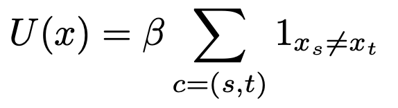

# Markov-Random-Fields

## Ising model
We aim to sample the following distribution on state space {0,1}^n where

We achieved sampling Ising model by using 3 different algorithms: Gibbs sampling, Metropolis sampling, ICM.

  Example with beta = 1.  :

  Example with beta = 3.  :

While MCMC algorithms Gibbs and Metropolis have theorical guarantee to converge to the designed distribution, ICM converge quickly to a local minimum. On the following graph we compare convergence of these algorithms by measuring how fast they minimize the global energy of the distribution.

If ICM is faster it requires to start from a suitable initial solution and if not it may not converge at all. On the following plots we compare the ability of respectively ICM, Gibbs and Metropolis algorithms to converge to Ising model distribution starting from a all white image.

## Potts model

We also sample the Potts model, a more generalized version of Ising model as the state space {0,1,2,...,q}^n is no more binary.

In the following we sampled:

In the following we sampled:

## Image denoising 

